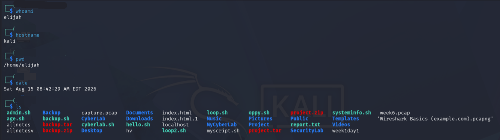

# Lab 01 — Linux Terminal Basics

## 🎯 Objective

The objective of this lab was to become familiar with basic Linux terminal commands and understand how they provide information about the current system and working environment.

---

## 🧰 Environment

* **Operating System:** Kali Linux
* **Environment:** Personal learning lab
* **Focus:** Linux command-line fundamentals

---

## 🧪 Commands Practiced

### 1. `whoami`

```bash
whoami
```

**Purpose:**
Displays the username of the currently logged-in user.

**Security relevance:**
Knowing the current user is important when working with Linux permissions, privileges, and security controls.

**Result:**
Command executed successfully and identified the current user.

---

### 2. `hostname`

```bash
hostname
```

**Purpose:**
Displays the hostname of the current machine.

**Security relevance:**
Understanding which system you are working on helps prevent mistakes when managing or testing multiple machines.

**Result:**

```text
kali
```

---

### 3. `pwd`

```bash
pwd
```

**Purpose:**
Displays the current working directory.

**Security relevance:**
Knowing your current location in the filesystem helps prevent accidental modification or deletion of files in the wrong directory.

**Result:**
The command returned the user's Kali Linux home directory.

> The personal username has been intentionally omitted from this public documentation.

---

### 4. `date`

```bash
date
```

**Purpose:**
Displays the system date and time.

**Security relevance:**
Accurate system time is important for reviewing logs, investigating events, troubleshooting, and correlating security activity.

**Result:**
The command successfully returned the current system date and time.

---

### 5. `ls`

```bash
ls
```

**Purpose:**
Lists files and directories in the current working directory.

**Security relevance:**
Understanding filesystem contents is a basic Linux administration skill and helps identify files, scripts, directories, and other resources.

**Result:**
The command successfully displayed the contents of the current directory.

---

## 📸 Evidence

The following screenshot shows the commands practiced during this lab:



Before publishing screenshots publicly, sensitive information such as usernames, passwords, API keys, tokens, private keys, and other personal information should be removed or obscured.

---

## 🧠 What I Learned

This lab helped me understand that basic Linux commands are more than memorization exercises.

Each command provides useful information about the system:

```text
whoami
   ↓
Current user

hostname
   ↓
Current machine

pwd
   ↓
Current location

date
   ↓
System time

ls
   ↓
Directory contents
```

These fundamentals provide a foundation for Linux administration and later cybersecurity and cloud security work.

---

## ✅ Lab Status

**Completed**

### Key Takeaway

> Strong cybersecurity skills start with understanding the systems you are working with.

