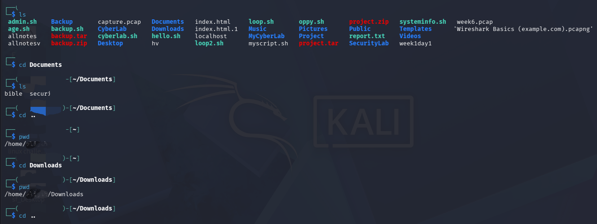

# Lab 02 — Linux Filesystem Navigation

## 🎯 Objective

Practice navigating the Linux filesystem using basic terminal commands in Kali Linux.

## 🧰 Environment

- Operating System: Kali Linux
- Environment: Personal learning lab
- Focus: Linux filesystem navigation

## 🧪 Commands Practiced

### 1. `ls`

```bash
ls
cd Documents
ls
cd ..
pwd
cd Downloads
pwd
cd ..

🔐 Security Relevance

Filesystem navigation is a fundamental Linux skill for cybersecurity professionals.

It is useful when:

Investigating files and directories
Locating configuration files
Reviewing logs
Examining suspicious files
Working with scripts
Navigating Linux servers
Managing cloud-based Linux systems

These skills provide a foundation for file permissions, processes, logs, SSH, security investigations, and cloud security.

📸 Evidence




🧠 What I Learned

This lab helped me understand how to navigate the Linux filesystem using the terminal.

Command	Purpose
ls	View directory contents
cd directory	Enter a directory
cd ..	Move to the parent directory
pwd	Display the current directory

Understanding these commands will help me work more confidently with Linux systems and prepare for more advanced cybersecurity and cloud security labs.

✅ Lab Status

Completed

Key Takeaway

Knowing where you are in a Linux filesystem is a basic but essential skill for cybersecurity work.
