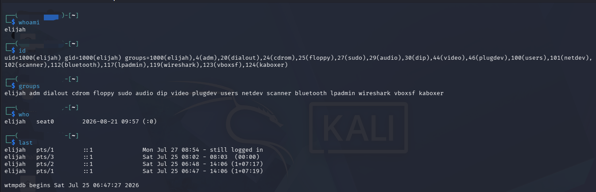

# Lab 03 — Linux User and Identity

## Objective

This lab documents basic Linux commands used to identify the current user, user ID, group memberships, and login activity.

## Commands Practiced

### `whoami`

Displays the username of the currently logged-in user.

### `id`

Displays the user ID (UID), group ID (GID), and groups associated with the current user.

### `groups`

Displays the groups the current user belongs to.

### `who`

Displays users currently logged into the system.

### `last`

Displays a history of previous login sessions.

## What I Learned

- How to identify the current Linux user.
- How to view user and group IDs.
- How Linux groups control user permissions and access.
- How to check active user sessions.
- How to review previous login activity.

These commands are useful in cybersecurity because user identities, permissions, and login activity are important when investigating systems and monitoring for suspicious activity.

## 📸 Evidence

## Lab Status

Completed ✅

