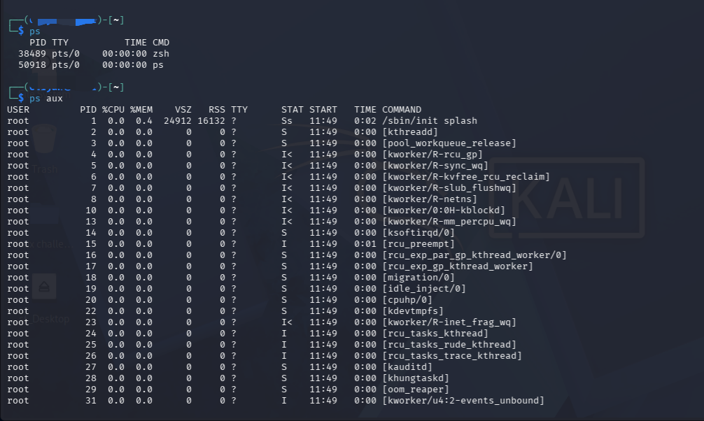
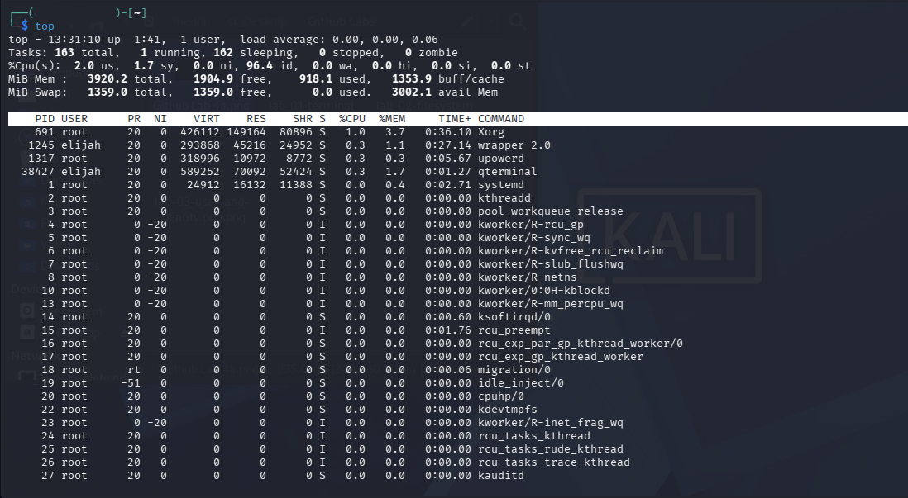

# Lab 04 — Running Processes

## Objective

This lab documents basic Linux commands used to view and monitor running processes.

## Commands Practiced

### `ps`

Displays processes running in the current terminal session.

### `ps aux`

Displays detailed information about running processes, including the user, process ID (PID), CPU usage, memory usage, and the command associated with each process.

### `top`

Provides a real-time view of running processes and system resource usage, including CPU and memory usage.

Press `q` to exit the `top` command.

## What I Learned

- How to view currently running processes.
- How to identify processes using their Process ID (PID).
- How to view CPU and memory usage.
- How to monitor processes in real time.
- Why process monitoring is important for Linux system administration and cybersecurity.

Process monitoring can help identify unusual or suspicious activity on a system. Understanding running processes is an important skill for security investigations and incident response.

## 📸 Evidence

### Process List

### Real-Time Process Monitoring

## Lab Status

Completed ✅
